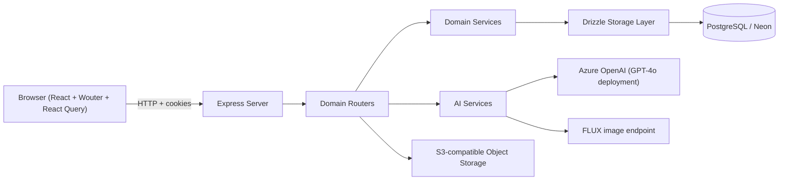

# MasteryMap Architecture

Last reviewed: 2026-02-21

## 1. Runtime Topology

MasteryMap runs as a single Node/Express process.

- In development, Express mounts Vite middleware (`server/vite.ts`).
- In production, Express serves static assets from `dist/public`.
- API routes are mounted in `server/routes.ts`.

## 2. Frontend Architecture

Frontend stack (see `client/`):

- React 18 + TypeScript
- Wouter for routing (`client/src/App.tsx`)
- TanStack Query for server state (`client/src/lib/queryClient.ts`)
- shadcn/ui + Radix UI + Tailwind CSS

Role-based page sets:

- Public: landing, project explorer, public project detail, public portfolio
- Student: dashboard, projects, milestone detail, assessment taking, portfolio
- Teacher: projects, assessments, submissions/grading, dashboard
- Admin: dashboard, user management

## 3. Backend Domain Structure

Backend domains live under `server/domains/` and are mounted centrally in `server/routes.ts`.

Mounted API groups:

- `auth`, `projects`, `assessments`, `submissions`, `self-evaluations`
- `competencies`, `credentials`, `portfolio`, `notifications`
- `ai`, `safety-incidents`, `contact`, `admin`, `analytics`
- `uploads` and `objects` (S3-backed file routes)

Projects and assessments are modularized via composition/factory patterns (`composition.ts`).

## 4. Data Layer

Primary schema is in `shared/schema.ts`.

Core entity groups:

- Identity and access: `users`, `auth_tokens`, `sessions`, `schools`
- Learning model: `learner_outcomes`, `competencies`, `component_skills`, `best_standards`
- Project workflow: `projects`, `milestones`, `project_teams`, `project_team_members`, `project_assignments`
- Assessment workflow: `assessments`, `submissions`, `grades`, `self_evaluations`
- Portfolio and recognition: `portfolio_artifacts`, `portfolios`, `credentials`
- Platform features: `notifications`, `safety_incidents`, `contact_requests`

## 5. Authentication and Authorization

- Access/refresh JWT cookies (`access_token`, `refresh_token`)
- `requireAuth` and `requireRole` middleware in `server/domains/auth/auth.controller.ts`
- Role model: `admin`, `teacher`, `student`
- Tier model on user (`free`, `enterprise`) with route-level gating on selected teacher/admin analytics and school-wide features

## 6. Security Controls

Implemented middleware in `server/middleware/security.ts`:

- `helmet` security headers
- Global API rate limiting (`/api`)
- Auth rate limiting (`/api/auth/login`)
- AI endpoint rate limiting
- Integer parameter validation and prompt sanitization helpers

## 7. AI and Safety Architecture

AI features are coordinated in `server/domains/ai/` and used by projects/assessments/submissions/self-evaluations.

Current AI-backed flows include:

- Project idea generation
- Milestone and assessment generation
- Submission feedback/grading helpers
- Tutor chat
- Self-evaluation feedback
- Credential suggestion logic

Safety handling:

- Tutor and self-evaluation workflows can flag risky content
- Safety incidents are persisted and exposed via `/api/safety-incidents`

## 8. Object Storage

`server/integrations/s3_storage/` provides:

- Upload endpoint: `POST /api/uploads/file`
- Object serving endpoint: `GET /objects/:objectPath(*)`

Used for:

- Student deliverables
- Assessment PDFs
- Project thumbnail assets

## 9. Architectural Notes

- Response format is not yet fully uniform across all domains: some routes return wrapped responses, others return raw JSON.
- Free-tier restrictions are enforced in several route groups; authorization depends on both role and tier.

